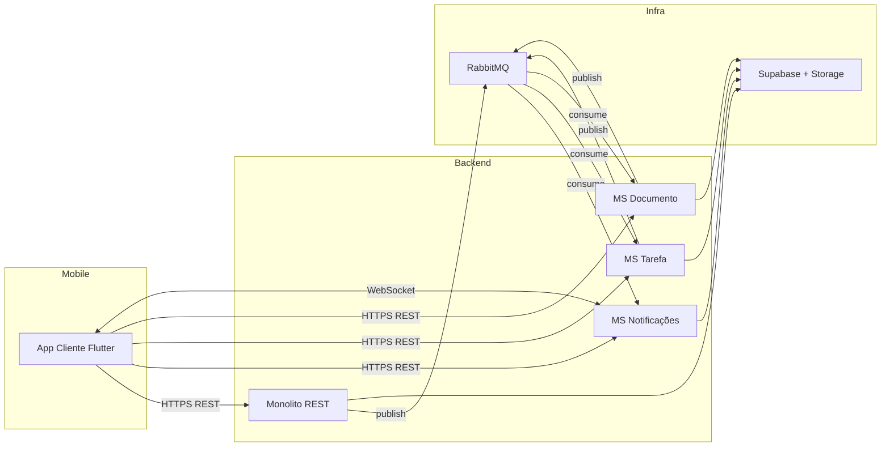

# Sistema para Aluguel Temporário de Residência (LAMD)

Projeto Integrador da disciplina **Laboratório de Desenvolvimento de Aplicações Móveis e Distribuídas** — PUC Minas, 5º período (1º/2026).

Aluna: **Brenda Evers**

## Visão geral

Sistema distribuído orientado a eventos para gerenciamento de aluguéis temporários compartilhados (moradias por comodato). Conta com dois aplicativos móveis em Flutter (cliente e prestador), backend REST em Node.js, middleware orientado a mensagens (RabbitMQ), cache em Redis e persistência polyglot (Supabase + MongoDB).

A documentação completa da proposta está em [Documentação LAMD.md](Documentação%20LAMD.md) e as orientações da disciplina em [Projeto LAMD.md](Projeto%20LAMD.md).

## Estrutura do monorepo

```
/
├── backend/
│   ├── monolito/         # Backend REST + Outbox Publisher (Sprints 1 e 2)
│   ├── ms-notificacoes/  # Microsserviço consumidor de eventos (Sprint 2)
│   ├── ms-tarefa/        # Esqueleto — Sprint 3
│   ├── ms-chat/          # Esqueleto — Sprint 3
│   └── ms-documento/     # Esqueleto — Sprint 3
├── mobile/
│   ├── cliente/         # App Flutter do comodatário (Sprint 3)
│   └── prestador/       # App Flutter do proprietário (Sprint 4)
├── docs/
│   ├── events.md
│   ├── relatorio-sprint2.md
│   ├── arquitetura.png
│   └── postman-collection.json
└── docker-compose.yml    # RabbitMQ local
```

## Sprints

| Sprint | Foco | Status |
|---|---|---|
| 1 | Backend REST + arquitetura | concluída |
| 2 | Integração com MOM (RabbitMQ) | concluída |
| 3 | Microsserviços (notificações, tarefa, documento) + App Flutter Cliente | concluída |
| 4 | App Flutter Prestador + entrega final | em andamento |

## Arquitetura distribuída



- **Outbox Pattern** em cada producer (monolito, MS Tarefa, MS Documento)
  com `OutboxWorker` que publica eventos atomicamente após a transação.
- **Idempotência** garantida no consumo via `processed_events` por serviço.
- **WebSocket** em `ms-notificacoes` (sala `user:<id>`) faz push em tempo
  real para o app cliente sempre que um novo evento de domínio chega.

Catálogo completo de eventos: [docs/events.md](docs/events.md).

## Como subir a infraestrutura local

```powershell
# 1. Subir RabbitMQ (raiz do repositório)
copy .env.example .env   # opcional — define credenciais do broker
docker compose up -d rabbitmq

# UI de management: http://localhost:15672  (user/pass do .env)
```

## Como executar

Cada módulo possui o próprio `README.md` com instruções:

- Backend monolito: [backend/monolito/README.md](backend/monolito/README.md)
- MS Notificações: [backend/ms-notificacoes/README.md](backend/ms-notificacoes/README.md)
- MS Tarefa: [backend/ms-tarefa/README.md](backend/ms-tarefa/README.md)
- MS Documento: [backend/ms-documento/README.md](backend/ms-documento/README.md)
- App Cliente (Flutter): [mobile/cliente/README.md](mobile/cliente/README.md)

### Roteiro rápido de execução local

```powershell
# 1. Subir RabbitMQ
docker compose up -d rabbitmq

# 2. Em terminais separados, subir cada serviço
cd backend/monolito       ; npm install ; npm run dev   # porta 3000
cd backend/ms-notificacoes; npm install ; npm run dev   # porta 3001 (HTTP + WS)
cd backend/ms-tarefa      ; npm install ; npm run dev   # porta 3002
cd backend/ms-documento   ; npm install ; npm run dev   # porta 3003

# 3. App Flutter (em outro terminal, com emulador Android aberto)
cd mobile/cliente
flutter pub get
flutter run
```

