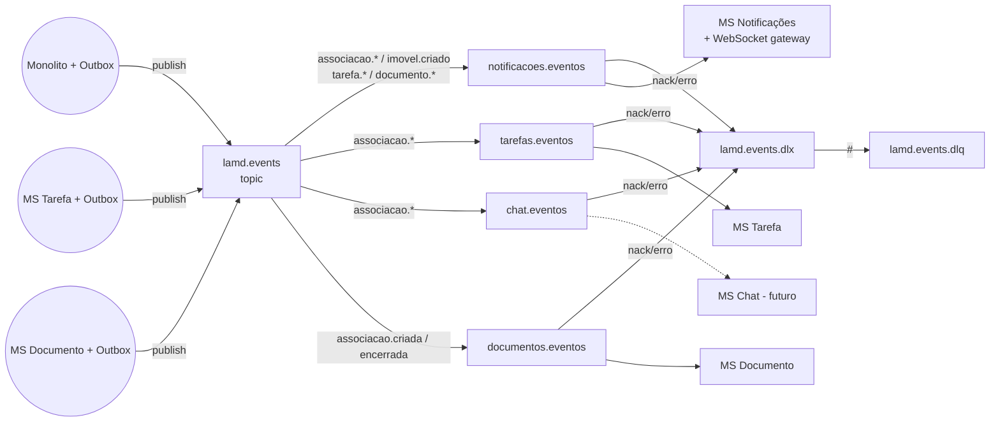

# Eventos de Domínio — Sprint 2

Este documento descreve o **contrato de eventos** publicado pelo Monolito LAMD no RabbitMQ e consumido pelos microsserviços.

## Envelope (JSON)

Todos os eventos seguem o mesmo envelope:

```json
{
  "eventId": "uuid v4",
  "eventType": "imovel.criado",
  "occurredAt": "2025-01-15T12:34:56.789Z",
  "source": "monolito",
  "version": 1,
  "payload": { /* específico por evento */ }
}
```

- **eventId**: UUID único — usado para idempotência pelos consumidores.
- **eventType**: nome do evento (também usado como _routing key_).
- **occurredAt**: timestamp ISO-8601 em UTC.
- **source**: identificador do produtor.
- **version**: versão do contrato do payload.
- **payload**: dados específicos do evento.

## Topologia AMQP

- **Exchange principal:** `lamd.events` (topic, durable)
- **Dead-Letter Exchange:** `lamd.events.dlx` (topic, durable)
- **DLQ:** `lamd.events.dlq` (durable, bind `#`)



## Catálogo de Eventos

### `imovel.criado`
Publicado quando um imóvel é cadastrado.

| Campo            | Tipo           | Descrição                       |
|------------------|----------------|---------------------------------|
| `imovelId`       | uuid           | Id do imóvel                    |
| `proprietarioId` | uuid           | Profile do proprietário         |
| `titulo`         | string         | Título do imóvel                |
| `endereco`       | string         | Endereço                        |
| `valorAluguel`   | number \| null | Valor do aluguel (opcional)     |
| `criadoEm`       | timestamp ISO  | Quando foi inserido             |

**Produtor:** monolito. **Bindings:** `notificacoes.eventos`.

---

### `associacao.criada`
Publicado ao criar uma associação imóvel↔comodatário.

| Campo            | Tipo           | Descrição                  |
|------------------|----------------|----------------------------|
| `associacaoId`   | uuid           | Id da associação           |
| `imovelId`       | uuid           | Id do imóvel               |
| `comodatarioId`  | uuid           | Profile do comodatário     |
| `proprietarioId` | uuid           | Profile do proprietário    |
| `dataInicio`     | date YYYY-MM-DD| Início do comodato         |
| `dataFim`        | date \| null   | Fim previsto (opcional)    |
| `criadoEm`       | timestamp ISO  | Quando foi inserido        |

**Produtor:** monolito. **Bindings:** `notificacoes.eventos`, `tarefas.eventos`, `chat.eventos`, `documentos.eventos`.

---

### `associacao.encerrada`
Publicado quando uma associação ativa é encerrada.

| Campo            | Tipo           | Descrição                  |
|------------------|----------------|----------------------------|
| `associacaoId`   | uuid           | Id da associação           |
| `imovelId`       | uuid           | Id do imóvel               |
| `comodatarioId`  | uuid           | Profile do comodatário     |
| `proprietarioId` | uuid           | Profile do proprietário    |
| `dataFim`        | date \| null   | Data efetiva de encerramento|
| `encerradaEm`    | timestamp ISO  | `now()` no instante do update|

**Produtor:** monolito. **Bindings:** `notificacoes.eventos`, `tarefas.eventos`, `chat.eventos`, `documentos.eventos`.

---

### `tarefa.criada` _(Sprint 3)_
Publicado pelo MS Tarefa ao registrar uma nova tarefa.

| Campo            | Tipo                 | Descrição                                    |
|------------------|----------------------|----------------------------------------------|
| `tarefaId`       | uuid                 | Id da tarefa                                 |
| `associacaoId`   | uuid                 | Id da associação                             |
| `imovelId`       | uuid                 | Id do imóvel                                 |
| `proprietarioId` | uuid                 | Profile do proprietário                      |
| `comodatarioId`  | uuid                 | Profile do comodatário (destinatário)        |
| `titulo`         | string               | Título da tarefa                             |
| `descricao`      | string \| null       | Descrição                                    |
| `recorrencia`    | enum                 | `unica` \| `diaria` \| `semanal` \| `mensal` |
| `prazo`          | date \| null         | Data limite (opcional)                       |
| `criadoEm`       | timestamp ISO        | Quando foi inserido                          |

**Produtor:** ms-tarefa. **Bindings:** `notificacoes.eventos`.

---

### `tarefa.concluida` _(Sprint 3)_
Publicado pelo MS Tarefa quando o comodatário marca uma tarefa como concluída.

| Campo            | Tipo           | Descrição                              |
|------------------|----------------|----------------------------------------|
| `tarefaId`       | uuid           | Id da tarefa                           |
| `associacaoId`   | uuid           | Id da associação                       |
| `imovelId`       | uuid           | Id do imóvel                           |
| `proprietarioId` | uuid           | Profile do proprietário (destinatário) |
| `comodatarioId`  | uuid           | Profile do comodatário                 |
| `titulo`         | string         | Título da tarefa                       |
| `concluidaEm`    | timestamp ISO  | Instante da conclusão                  |

**Produtor:** ms-tarefa. **Bindings:** `notificacoes.eventos`.

---

### `documento.solicitado` _(Sprint 3)_
Publicado pelo MS Documento ao registrar uma solicitação (manual pelo proprietário
ou automática ao processar `associacao.criada`).

| Campo            | Tipo           | Descrição                                  |
|------------------|----------------|--------------------------------------------|
| `documentoId`    | uuid           | Id do documento                            |
| `associacaoId`   | uuid           | Id da associação                           |
| `imovelId`       | uuid           | Id do imóvel                               |
| `proprietarioId` | uuid           | Profile do proprietário                    |
| `comodatarioId`  | uuid           | Profile do comodatário (destinatário)      |
| `tipo`           | string         | Tipo lógico (`rg`, `comprovante_renda`, …) |
| `titulo`         | string         | Título legível                             |

**Produtor:** ms-documento. **Bindings:** `notificacoes.eventos`.

---

### `documento.enviado` _(Sprint 3)_
Publicado quando o comodatário faz upload do arquivo solicitado.

| Campo            | Tipo           | Descrição                              |
|------------------|----------------|----------------------------------------|
| `documentoId`    | uuid           | Id do documento                        |
| `associacaoId`   | uuid           | Id da associação                       |
| `imovelId`       | uuid           | Id do imóvel                           |
| `proprietarioId` | uuid           | Profile do proprietário (destinatário) |
| `comodatarioId`  | uuid           | Profile do comodatário                 |
| `tipo`           | string         | Tipo lógico                            |
| `titulo`         | string         | Título legível                         |

**Produtor:** ms-documento. **Bindings:** `notificacoes.eventos`.

---

### `documento.aprovado` _(Sprint 3)_
Publicado quando o proprietário aprova um documento enviado.

| Campo            | Tipo           | Descrição                                  |
|------------------|----------------|--------------------------------------------|
| `documentoId`    | uuid           | Id do documento                            |
| `associacaoId`   | uuid           | Id da associação                           |
| `imovelId`       | uuid           | Id do imóvel                               |
| `proprietarioId` | uuid           | Profile do proprietário                    |
| `comodatarioId`  | uuid           | Profile do comodatário (destinatário)      |
| `tipo`           | string         | Tipo lógico                                |
| `titulo`         | string         | Título legível                             |

**Produtor:** ms-documento. **Bindings:** `notificacoes.eventos`.

---

### `documento.rejeitado` _(Sprint 3)_
Publicado quando o proprietário rejeita um documento enviado.

| Campo            | Tipo           | Descrição                                  |
|------------------|----------------|--------------------------------------------|
| `documentoId`    | uuid           | Id do documento                            |
| `associacaoId`   | uuid           | Id da associação                           |
| `imovelId`       | uuid           | Id do imóvel                               |
| `proprietarioId` | uuid           | Profile do proprietário                    |
| `comodatarioId`  | uuid           | Profile do comodatário (destinatário)      |
| `tipo`           | string         | Tipo lógico                                |
| `titulo`         | string         | Título legível                             |
| `observacao`     | string \| null | Motivo da rejeição (opcional)              |

**Produtor:** ms-documento. **Bindings:** `notificacoes.eventos`.

## Garantias

- **Atomicidade entre estado e evento:** uso do _Outbox Pattern_ em todos os produtores (monolito, ms-tarefa, ms-documento). Cada produtor possui sua própria tabela de outbox e um worker dedicado que faz polling com `SELECT ... FOR UPDATE SKIP LOCKED` e publica no RabbitMQ.
- **At-least-once delivery:** mensagens publicadas com `persistent: true`. Em caso de crash entre publicação e `mark_*_outbox_published`, a mensagem pode ser republicada — daí a importância da idempotência no consumidor.
- **Idempotência no consumidor:** cada microsserviço mantém uma tabela `processed_events*` (PK = `event_id`) que impede efeitos colaterais duplicados.
- **Entrega assíncrona ao app mobile:** o MS Notificações persiste a notificação e, na mesma transação lógica, faz push em tempo real via WebSocket (`socket.io`) para a sala `user:<userId>`. O cliente atualiza badge e listas sem polling.
- **Retry e DLQ:** mensagens com envelope inválido, sem handler ou que lançam exceção vão para `lamd.events.dlq` via DLX.
